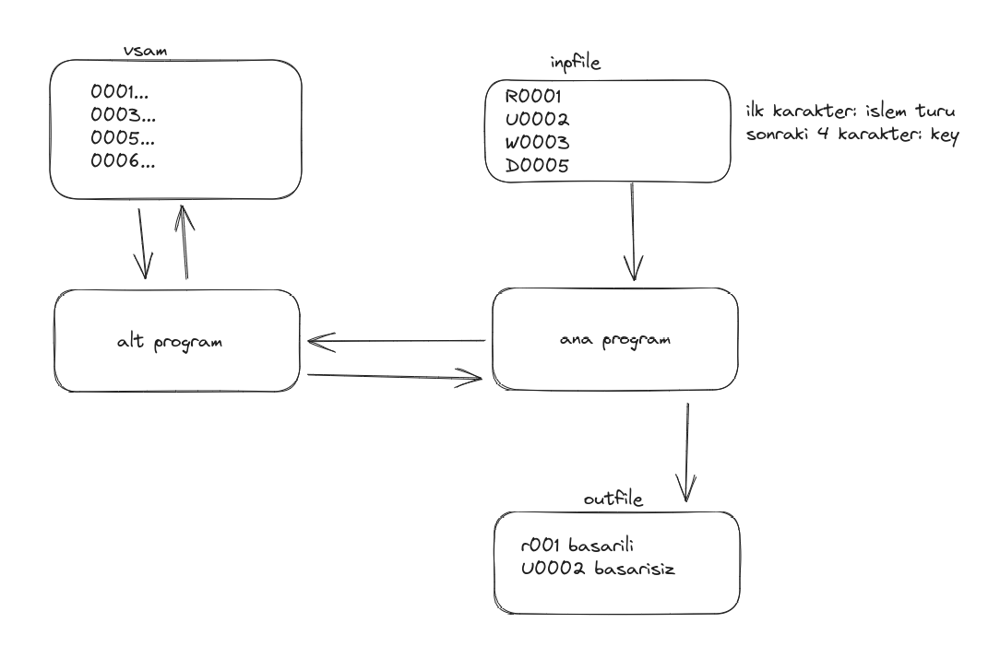

# akbank_cobol_final_case

## Aciklama
Bu projede iki adet program kullanarak programlar arasinda is bolumu yapmayi ve bu programlarda set, evaulate, inspect, string gibi statementlari kullanarak bu statementlarin kullanimini da ogrenmis oluyoruz. Asagidaki fotograf sayesinde programin calisma mantigini kavrayabilirsiniz. Ana program ilk olarak inpfile'dan islem turu ve id alarak bu islem turu ve id ile alt programi tetikleyerek sadece alt programin erisimi oldugu VSAM dosyasi uzerinde gerekli islemleri gerceklestirir. Daha sonra anaprogram gerceklestirilen islemlerin bir raporunu yeni bir cikti dosyasinda olusturur.

